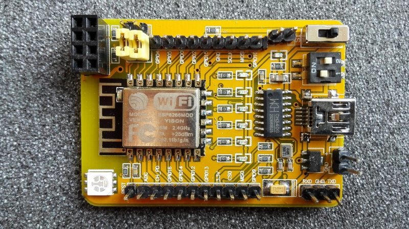
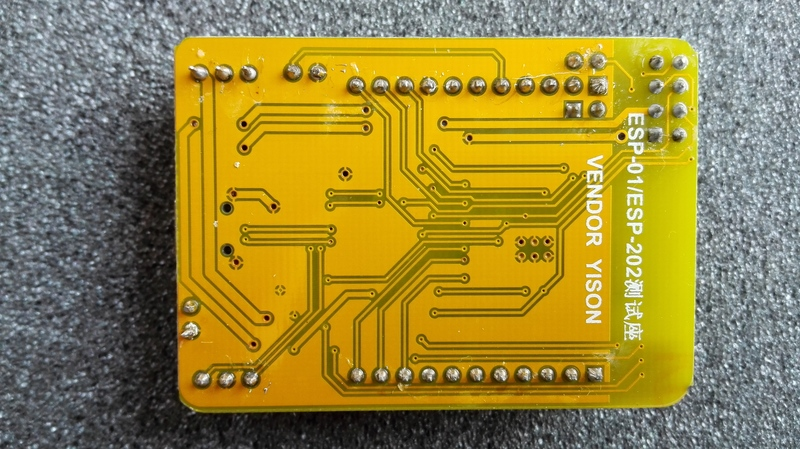
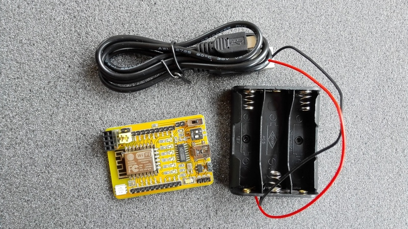
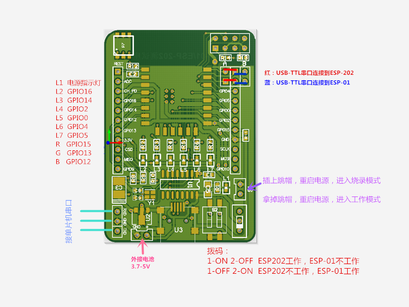

# YISON ESP-01/ESP-202 Development Board

Documentation on the ESP-01/ESP-202 development board from Yison

# Images

# LED Pinout

'''On the board the labels for GPIO4 and GPIO5 are switched!'''

| LED       | GPIO | Pin |
|-----------|------|-----|
| on module |      |   1 |
| 1         |   16 |  16 |
| 2         |   14 |  14 |
| 3         |    2 |   2 |
| 4         |    0 |   0 |
| 5         |    5 |   4 |
| 6         |    4 |   5 |
| RGB/red   |      |  12 |
| RGB/blue  |      |  13 |
| RGB/green |      |  15 |

*Pin* here stands for the pin number to be used in code to access these LEDs.

# Links and documentation

* SDK, videos, examples, android app (download code is "f9ff"): http://yunpan.cn/cFZYspMINqpMn
* discussion on Reddit: https://www.reddit.com/r/esp8266/comments/438f7w/new_test_board_esp202_esp12f/?st=irwesngb&sh=45756999
* discussion on esp8266.com: http://www.esp8266.com/viewtopic.php?f=5&t=5520
+ ESP-12F documentation: http://www.electrodragon.com/w/ESP-12F_ESP8266_Wifi_Board

# Example

    int LEDS[6] = { LED_BUILTIN_1, LED_BUILTIN_2, LED_BUILTIN_3, LED_BUILTIN_4, LED_BUILTIN_5, LED_BUILTIN_6 };

    void setup() {
      for(int x=0; x<6; x++) {
        pinMode(LEDS[x], OUTPUT);
      }
    }

    void loop() {
      for(int x=0; x<6; x++) {
        digitalWrite(LEDS[x], LOW); // switch led on
        delay(100);
        digitalWrite(LEDS[x], HIGH); // switch led off
        delay(10);
      }
    }
